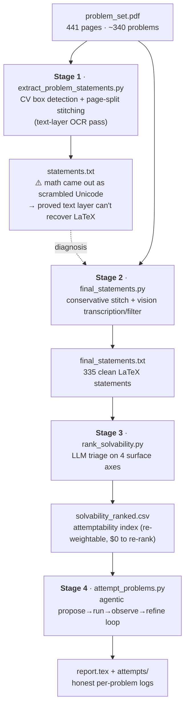
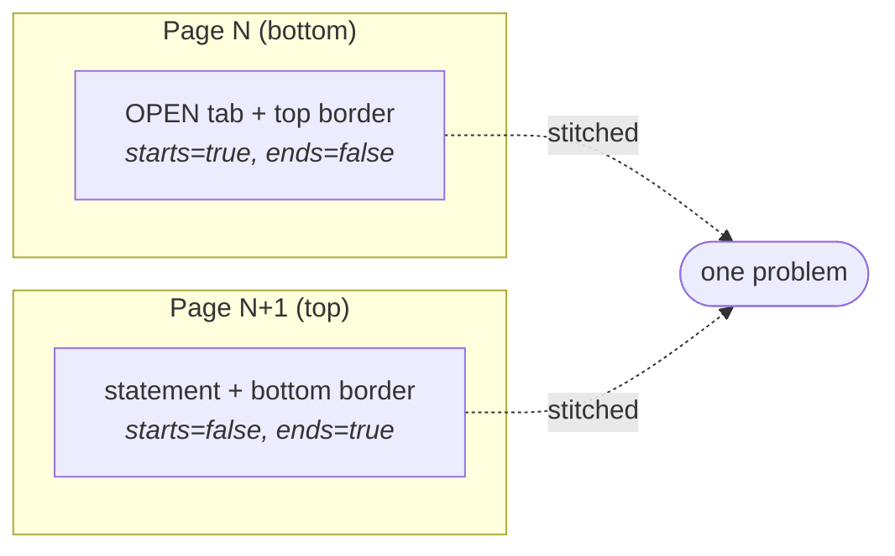
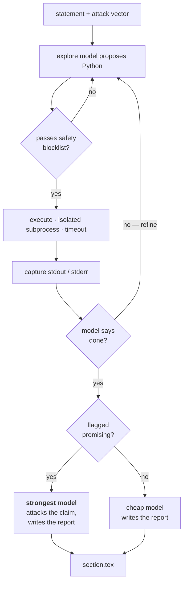

# The Erdős Machine

An end-to-end pipeline that scrapes the [Erdős Problems](https://www.erdosproblems.com)
database out of a PDF, extracts every problem statement as LaTeX with computer
vision, triages them for *attemptability* with an LLM, and then turns an autonomous
code-writing agent loose on the most promising ones — logging everything it tries
into a LaTeX report.

It works. It just doesn't solve any open Erdős problems — and it was never going to.
This README documents what was built, the results, and an honest account of why the
*goal* was a category error even though the *engineering* succeeded. The methodology
is the deliverable; the null results are the integrity.

---

## TL;DR

| | |
|---|---|
| **Input** | A 441-page print-to-PDF of ~340 Erdős problems |
| **Extracted** | 335 problem statements as clean LaTeX (CV + vision OCR) |
| **Triaged** | All 335 scored on a 4-axis attemptability index |
| **Attempted** | Top 10 number-theory targets, agentic compute loop |
| **Result** | 10/10 "no counterexample found up to N, consistent with the conjecture, no progress" |
| **Verdict** | A solid experimental-math + agent-engineering project. Not a path to solving open problems. |

---

## The pipeline



### Stage 1 — CV extraction (`extract_problem_statements.py`)

Each problem on the site lives inside a bordered rounded rectangle. Pure OpenCV finds
it with no ML: a permissive ink threshold (handles both faint and bold borders), a
morphological **length filter** that keeps long horizontal/vertical border lines while
rejecting text, plus width/edge filters so page chrome (search boxes, screenshot
borders) isn't mistaken for a problem.

The hard part is that a box can **split across a page break**. Each detected box is
classified by which borders it has:



This stage's `--ocr text` mode reads the PDF text layer (free, instant) — and that's
how we *learned* the math doesn't survive: MathJax renders equations as separately
positioned glyph spans, so the text layer yields prose in one stream and scrambled
symbols (`𝐴⊆{1,…,𝑁}`, `𝑁≫2𝑛`) in another. No CV or text parsing reconstructs
`\sum` from a picture of `∑`. That finding is what motivated Stage 2.

### Stage 2 — Vision transcription + filtering (`final_statements.py`)

Re-detects the boxes with a **conservative stitcher** (a split start only merges with
the immediately following continuation, capped at a short run — this killed an earlier
bug that swallowed several problems into one entry), then sends each box image to a
vision model that both transcribes it to clean LaTeX *and* judges whether it's a real
self-contained statement (dropping blank start-halves and junk).

Output: **335** statements. The pipeline also reports that exactly **23** problems
genuinely split across a page break (the earlier "~80 mystery" was the old buggy
stitcher inflating the count). The 335-vs-340 gap is a handful of detection edge cases —
acknowledged as a limitation, not chased.

### Stage 3 — Attemptability triage (`rank_solvability.py`)

You can't score "solvability" — these are famous open problems and the honest prior on
solving them is ~zero. So the index measures something the model *can* judge from the
statement: **how good a target is this for an AI+code attempt?** Four axes (1–5):

- **accessibility** — how elementary the objects are
- **computational_handle** — can code make real progress on small cases?
- **counterexample_reachable** — could a feasible search find a counterexample?
- **depth_required** — incremental, or needs one famous-hard idea? (inverse difficulty)

The model returns the raw axis scores; Python computes the weighted composite, so the
ranking can be **re-weighted for $0** (results are cached by statement hash). Output is
an Excel-sortable CSV.

### Stage 4 — The agent (`attempt_problems.py`)

For each top target: an explore model proposes a self-contained Python experiment, the
script executes it, feeds the output back, and the model refines — up to N rounds.



The escalation is deliberately adversarial: a "promising" flag (e.g. a claimed
counterexample) routes the final report to the strongest model with instructions to
**assume a bug and try to break the result** — because for a decades-open problem, the
single most likely explanation for a "counterexample" is an off-by-one or overflow in
the agent's own code.

**Safety note:** this executes LLM-written code on your machine. There's a static
blocklist (no `os.system`/`subprocess`/`socket`/file-writes/`eval`/network), an
isolated subprocess, and a per-run timeout — but a blocklist is a *speed bump, not a
sandbox*. Run it in WSL or a throwaway VM; use `--dry-run` first to inspect generated
code before anything executes.

---

## Example results

The top-10 number-theory targets all returned the same shape of result. Two were
genuinely *interesting as experimental mathematics*, even though neither is progress on
a proof:

**#458** — Is `lcm(1..p_{k+1}−1) < p_k · lcm(1..p_k)` for all k? Verified for all
`p_k ≤ 10⁷` (≈665k prime pairs) in log-space. The **minimum margin (≈0.154) occurs
uniquely at k=4** (p=7), explained exactly by the prime powers `8=2³` and `9=3²` falling
in the gap between 7 and 11 — a clean, satisfying observation.

**#291** — Define `Hₙ = aₙ/Lₙ`; do `gcd(aₙ,Lₙ)=1` and `>1` each happen infinitely
often? Both occur abundantly up to N=5000 (22% / 78%). The `gcd=1` runs **cluster
conspicuously at prime powers** (9=3², 27=3³, 49=7², 289=17², 361=19², …) — a real
thread tied to p-adic valuations of harmonic numbers (with a few telling exceptions
like 968 and 3488 that don't fit, which is itself interesting).

**#242 (Erdős–Straus)** — the futility made concrete: the agent's Python verified
`4/n = 1/x+1/y+1/z` up to **n ≈ 10⁴** before timing out. The literature has this verified
past **10¹⁷** in optimized C. We weren't extending a frontier; we were re-walking ground
covered by hand in the 1950s.

| # | Problem (short) | Verified to | Outcome |
|---|---|---|---|
| 647 | running max of `m+τ(m)` | 10⁶ | no counterexample |
| 287 | Egyptian-fraction gaps ≥ 3 | N=30 | no counterexample |
| 458 | lcm inequality | 10⁷ | no counterexample · min margin at k=4 |
| 677 | distinct sliding-window lcm | 2×10⁵ | no counterexample |
| 985 | prime primitive root < p | 10⁷ | no counterexample |
| 242 | Erdős–Straus 4/n | 10⁴ | no counterexample (lit: >10¹⁷) |
| 291 | gcd(aₙ,Lₙ) infinitely often | 5000 | both occur · prime-power clustering |
| 375 | composite-gap SDR | 2×10⁶ | no counterexample |
| 385 | `F(n)=max(m+p(m)) > n` | 5×10⁵ | no counterexample · gap drifts up |
| 389 | factorial-window divisibility | n≤200 | inconclusive (search cutoff too small) |

---

## Why it isn't what we hoped

The pipeline did exactly what it was built to do. The disappointment is in the *result*,
and the result was deterministic from the premise:

- **A problem is open *because* it resists finite checking.** If a small computational
  search could settle it, it would already be settled. Scaling the search (more rounds,
  more problems, more tokens) is **orthogonal** to the missing ingredient, which is a new
  proof idea. You can't brute-force your way to an insight.
- **The famous ones are already checked far beyond what a Python agent reaches.**
  Erdős–Straus to 10¹⁷, etc. There's no frontier to extend with toy ranges.
- **"No counterexample up to N" is the expected baseline**, not evidence. It's equally
  consistent with the conjecture being true *or* with the first counterexample lying just
  past N.
- **LLM triage is a heuristic, not an oracle.** `computational_handle` is the most
  predictive axis and also the easiest to get wrong from the statement alone — a problem
  can look finitely-checkable and then explode combinatorially.

So for the goal of *solving* these: it's hopeless, and predictably so — not because the
engineering is weak, but because the premise was a category error.

## What's actually valuable

- **The pipeline as an engineering artifact.** CV extraction with page-split stitching,
  LLM triage with locally-recomputable scoring, a guard-railed autonomous code-executing
  agent with adversarial verification, auto-generated reports. "I built an agent that
  attempts open problems and honestly evaluates *why* it can't solve them" is a strong,
  mature writeup.
- **A couple of clean experimental-math observations** (#458's k=4 margin, #291's
  prime-power clustering) worth writing up as expository notes.
- **A negative result documented with integrity** — which is rarer and more useful than
  it sounds.

## If you ever come back to it

The only version with non-zero (lottery-odds) EV is to stop aiming at famous,
heavily-checked conjectures and target **under-verified** ones — recently-added or
obscure problems nobody has computed far, where a counterexample (if any) might be small.
Counterexamples to old beliefs *do* occasionally fall to search (Pólya, Mertens, Euler's
sum-of-powers). But that needs (a) a reliable way to identify under-explored problems
(the LLM can't), and (b) fast code reaching 10¹²⁺, not Python toy ranges. A lottery
ticket, not a plan.

---

## Setup

```bash
pip install anthropic numpy scipy sympy mpmath networkx pandas matplotlib \
            numba sortedcontainers more-itertools tqdm pymupdf \
            opencv-python-headless pillow
# optional vision-OCR backend for stage 1: pip install transformers torch

# Windows (PowerShell): set per-session, or setx for permanent
$env:ANTHROPIC_API_KEY = "sk-ant-..."
```

> PyMuPDF gotcha: if `import fitz` fails with a `static/` error, an unrelated PyPI
> package named `fitz` has shadowed it — `pip uninstall -y fitz frontend` then
> `pip install --upgrade pymupdf`.

## Usage

```bash
# Stage 1 — CV extraction (run --ocr text first to inspect, then --ocr nougat)
python extract_problem_statements.py --pdf problem_set.pdf --ocr text --crops dbg
python extract_problem_statements.py --pdf problem_set.pdf --ocr nougat

# Stage 2 — vision transcription + filtering
python final_statements.py --pdf problem_set.pdf --limit 15          # cheap dry run
python final_statements.py --pdf problem_set.pdf --model claude-haiku-4-5-20251001

# Stage 3 — triage / ranking  (edit WEIGHTS at top of file to re-rank for free)
python rank_solvability.py --in final_statements.txt --model claude-haiku-4-5-20251001

# Stage 4 — agent  (ALWAYS --dry-run first; prefer WSL/VM)
python attempt_problems.py --dry-run
python attempt_problems.py --rounds 4 --timeout 90
```

## Repo structure

```
NumberTheory/
├── extract_problem_statements.py   # Stage 1 — CV box detection + split stitching
├── final_statements.py             # Stage 2 — conservative stitch + vision OCR/filter
├── rank_solvability.py             # Stage 3 — attemptability triage → CSV
├── attempt_problems.py             # Stage 4 — agentic compute loop → report
├── problem_set.pdf                 # input
├── statements.txt                  # stage-1 output (text layer; math garbled)
├── final_statements.txt            # stage-2 output (335 clean LaTeX statements)
├── solvability_ranked.csv          # stage-3 output (sorted, re-weightable)
├── top_ten_targets.txt             # the 10 problems handed to the agent
├── report.tex                      # stage-4 report (compile with pdflatex)
├── attempts/<n>/                   # per-problem: roundK.py, roundK.out, transcript.json
├── vision_cache.jsonl              # stage-2 cache (reruns free)
└── score_cache.jsonl              # stage-3 cache (re-ranking free)
```

## Models used

`claude-haiku-4-5` / `claude-sonnet-4-6` for the high-volume transcription, triage, and
exploration passes; `claude-opus-4-8` reserved for adversarial verification of any flagged
result.

## A note on the name

"The Erdős Machine" is aspirational and a little tongue-in-cheek. Erdős believed God kept
a *Book* of the most beautiful proofs. This repo does not contain any of them. What it
contains is an honest attempt to find out whether a machine could — and a clear answer
about where the boundary actually is.
